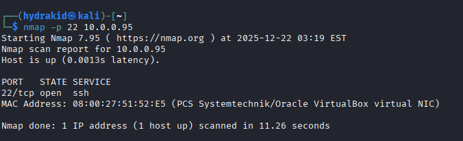
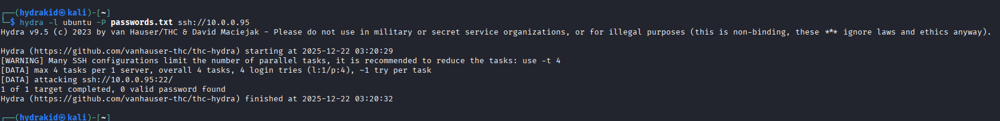
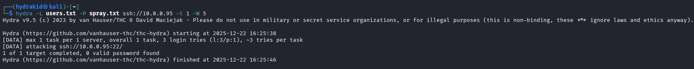

# SSH Brute Force Attack – Simulation

This document describes a simulated SSH brute force attack executed within the SOC lab environment.  
The scenario is designed to generate authentication-related telemetry and validate detection, investigation, and alerting capabilities in **Wazuh**.

> **Disclaimer**  
> This activity was conducted in an isolated lab environment for **educational and defensive security purposes only**.

---

## 1. Objective

- Simulate credential brute force activity against an SSH service  
- Generate multiple failed SSH authentication attempts  
- Achieve a successful SSH login  
- Validate Wazuh detection rules and MITRE ATT&CK mapping  
- Produce telemetry suitable for SOC investigation workflows  

---

## 2. Environment Overview

| Role            | Operating System | IP Address    | Notes                                  |
|-----------------|------------------|---------------|----------------------------------------|
| Attacker        | Kali Linux       | 10.0.0.226    | Untrusted external attacker machine    |
| Target / Victim | Ubuntu Linux     | 10.0.0.95     | Monitored endpoint with Wazuh Agent    |

**Target Service**
- Service: OpenSSH  
- Port: 22  

---

## 3. Tools Used

- Kali Linux  
- THC-Hydra  
- Nmap  
- OpenSSH  
- Wazuh (Agent, Manager, Indexer, Dashboard)  

---

## 4. Attack Phases

### 4.1 Reconnaissance

The attacker first verified SSH service availability on the target system.

```bash

nmap -p 22 10.0.0.95
```
### Result
PORT STATE SERVICE
22/tcp open ssh

This confirmed that the SSH service was exposed and accessible, making it a viable target for brute force attack simulation.

### 4.2 Brute Force Execution

After confirming service availability, the attacker launched a credential brute force attack against the SSH service using THC-Hydra.

```bash
hydra -l ubuntu -P passwords.txt ssh://10.0.0.95
```
---

## 5. Detection Context
During the attack, the following telemetry was generated and collected:

SSH authentication failures logged by the SSH daemon

Successful SSH authentication following repeated failures

Authentication events recorded in /var/log/auth.log

Logs collected by the Wazuh Agent and forwarded to the Wazuh Manager

The activity was visible in the Wazuh Dashboard under:

Threat Hunting → Events

This confirmed that the attack produced sufficient telemetry for SOC detection and investigation workflows.

---

## 6. MITRE ATT&CK Mapping

| Technique ID    | Technique Name   | Tactic               | Description                                                        |
|-----------------|------------------|----------------------|--------------------------------------------------------------------|
| T1110           | Brute Force      | Credential Access    | Adversary attempts to gain access by guessing valid credentials    |

## 7. Evidence (Screenshots)

### SSH Service Discovery
The attacker verified SSH service availability on the target system.


### Brute Force Attack Execution (Hydra)
The attacker launched a credential brute force attack using THC-Hydra.


### Alternate Attack Attempt – Password Spraying
A password spraying attempt was also executed to simulate a lower-noise attack technique.



---

## 8. Outcome & Learnings
This simulation successfully demonstrated:

- Generation of realistic SSH brute force telemetry

- Reliable log collection and forwarding by the Wazuh Agent

- Accurate detection and alerting by Wazuh

- Clear mapping to MITRE ATT&CK technique T1110

- A strong foundation for SOC alert triage, investigation, and response validation


