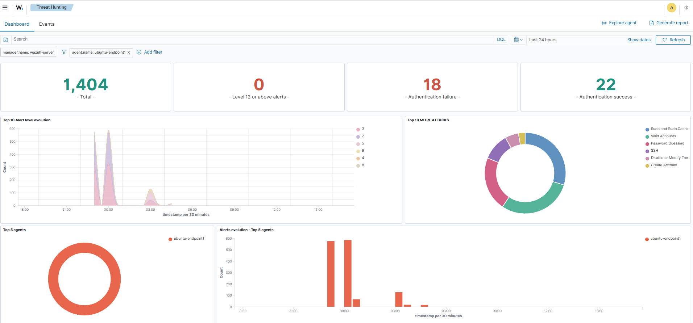
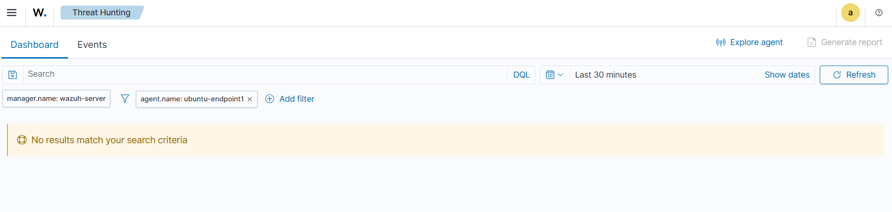

# Detection Improvements – SSH Brute Force

## Current Detection State
The lab relies on default Wazuh SSH authentication rules which effectively detect failed and successful login events.

However, default rules generate high alert volume in production environments.

---

## Detection Gaps

- Single failed SSH attempts are noisy.
- No built-in correlation between failures and success.
- No enrichment (geo/IP reputation).
- No dynamic severity adjustment.

---

## Recommended Improvements

### 1. Threshold-Based Detection
Trigger alerts only after:
- X failed attempts within Y minutes.

### 2. Correlation Logic
Raise alert severity when:
- Failed logins → successful login → sudo activity.

### 3. Contextual Enrichment
- Enrich source IP with reputation data.
- Flag internal vs external source IPs.

---

## Example Detection Logic (Conceptual)

IF:
- ≥5 SSH failures from same IP within 5 minutes
AND
- SSH success from same IP within 10 minutes

THEN:
- Raise High severity alert
- Tag as potential credential compromise

---

## False Positive Reduction

- Ignore known admin IPs.
- Suppress alerts during maintenance windows.
- Use adaptive thresholds per host role.

---

## Detection Engineering Mindset
Effective SOC detection prioritizes **signal quality over alert quantity**. Correlation and tuning are essential to reduce analyst fatigue while maintaining coverage.

---

## 📸 Evidence
### Alerts Before Mitigation
High alert volume observed before automated blocking.

### Alerts After Mitigation
Alert volume reduced after Fail2Ban enforcement.

